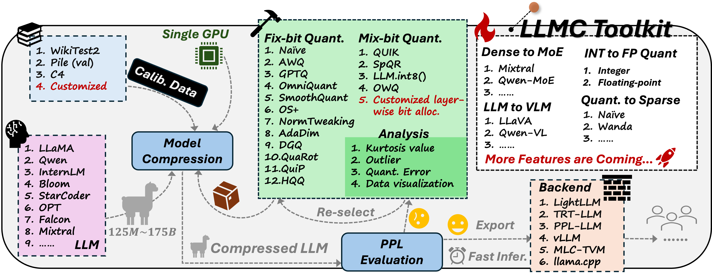
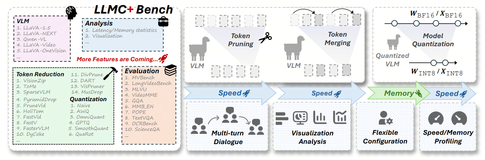
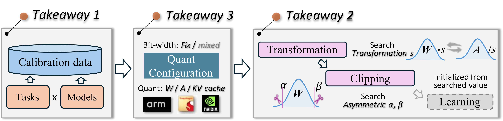

<div align="center" style="font-family: charter;">
<h1> LightCompress: Towards Accurate and Efficient AIGC Model Compression </h1>





[](https://opensource.org/licenses/Apache-2.0)
[](https://deepwiki.com/ModelTC/LightCompress)
[](https://arxiv.org/abs/2405.06001)
[](https://arxiv.org/abs/2508.09981)
[](https://discord.com/invite/NfJzbkK3jY)
[](http://qm.qq.com/cgi-bin/qm/qr?_wv=1027&k=I9IGPWWj8uuRXWH3_ELWjouf6gkIMgUl&authKey=GA3WbFAsm90ePJf%2FCbc7ZyXXq4ShQktlBaLxgqS5yuSPAsr3%2BDKMRdosUiLYoilO&noverify=0&group_code=526192592)
[](https://llmc-en.readthedocs.io/en/latest/)
[](https://llmc-zhcn.readthedocs.io/en/latest/)&#160;

**\[ English | [中文](README_zh.md) \]**

</div>

> **📢 Notice**: This repository was formerly known as **LLMC** and has been renamed to **LightCompress**.

**LightCompress** is an off-the-shell tool designed for compressing aigc models(LLM, VLM, Diffusion ...), leveraging state-of-the-art compression algorithms to enhance efficiency and reduce model size without compromising performance. You can download the Docker image that can run LightCompress with the following command. Users in mainland China are recommended to use Alibaba Cloud Docker.

```shell
# docker hub: https://hub.docker.com/r/llmcompression/llmc
docker pull llmcompression/llmc:pure-latest

# aliyun docker: registry.cn-hangzhou.aliyuncs.com/yongyang/llmcompression:[tag]
docker pull registry.cn-hangzhou.aliyuncs.com/yongyang/llmcompression:pure-latest
```

**Community**: [Discord Server](https://discord.com/invite/NfJzbkK3jY), [Tencent QQ Group](http://qm.qq.com/cgi-bin/qm/qr?_wv=1027&k=I9IGPWWj8uuRXWH3_ELWjouf6gkIMgUl&authKey=GA3WbFAsm90ePJf%2FCbc7ZyXXq4ShQktlBaLxgqS5yuSPAsr3%2BDKMRdosUiLYoilO&noverify=0&group_code=526192592).

**Docs**: [English](https://llmc-en.readthedocs.io/en/latest/), [Chinese](https://llmc-zhcn.readthedocs.io/en/latest/).

> **Recommended Python Version**: We recommend using **Python 3.11** for local development and installation. This matches the project's Docker images and CI configuration, and is generally more stable than Python 3.12 for the current dependency set.

## :fire: Latest News

- **Nov 9, 2025:** 🍺🍺🍺 Our work [**LLMC+: Benchmarking Vision-Language Model Compression with a Plug-and-play Toolkit**](https://arxiv.org/abs/2508.09981) has been accepted by AAAI 2026.

- **August 13, 2025:** 🚀 We have open-sourced our compression solution for **vision-language models (VLMs)**, supporting over a total of **20 algorithms** that cover both **token reduction** and **quantization**. This release enables flexible, plug-and-play compression strategies for a wide range of multimodal tasks. please refer to the [documentation](https://llmc-en.readthedocs.io/en/latest/advanced/token_reduction.html).

- **May 12, 2025:** 🔥 We now fully support quantization for the **`Wan2.1`** series of video generation models and provide export of truly quantized **INT8/FP8** weights, compatible with the [lightx2v](https://github.com/ModelTC/lightx2v) inference framework. For details, please refer to the [lightx2v documentation](https://llmc-en.readthedocs.io/en/latest/backend/lightx2v.html).

- **Feb 07, 2025:** 🔥 We now fully support quantization of large-scale **`MOE`** models like **`DeepSeekv3`**, **`DeepSeek-R1`**, and **`DeepSeek-R1-zero`** with **`671B`** parameters. You can now directly load FP8 weights without any extra conversion. AWQ and RTN quantization can run on a single 80GB GPU, and we also support the export of true quantized **INT4/INT8** weights.

- **Nov 20, 2024:** 🔥 We now fully support the quantization of ✨`DeepSeekv2(2.5)` and other `MOE` models, as well as ✨`Qwen2VL`, `Llama3.2`, and other `VLM` models. Supported quantization methods include ✅integer quantization, ✅floating-point quantization, and advanced algorithms like ✅AWQ, ✅GPTQ, ✅SmoothQuant, and ✅Quarot.

- **Nov 12, 2024:** 🔥 We have added support for 💥`static per-tensor activation quantization` across various models and algorithms, covering ✅integer quantization and ✅floating-point quantization to further optimize performance and efficiency. Additionally, we now support exporting ✨`real quantized models` and using the [VLLM](https://github.com/vllm-project/vllm) and [SGLang](https://github.com/sgl-project/sglang) backends for inference acceleration. For more details, refer to the [VLLM documentation](https://llmc-en.readthedocs.io/en/latest/backend/vllm.html) and [SGLang documentation](https://llmc-en.readthedocs.io/en/latest/backend/sglang.html).

- **Sep 26, 2024:** 🔥 We now support exporting 💥`FP8 quantized(E4M3, E5M2)` models from 🚀`LLMC` to advanced inference backends such as [VLLM](https://github.com/vllm-project/vllm) and [SGLang](https://github.com/sgl-project/sglang). For detailed usage, please refer to the [VLLM documentation](https://llmc-en.readthedocs.io/en/latest/backend/vllm.html) and [SGLang documentation](https://llmc-en.readthedocs.io/en/latest/backend/sglang.html).

<details close>
<summary>Previous News</summary>

- **Sep 24, 2024:** 🔥 We have officially released ✅INT4 and ✅INT8 models of ✨`Llama-3.1-405B`, quantized using 🚀`LLMC` in `save_lightllm` mode. You can download the model parameters [here](https://huggingface.co/Dongz/llama31-405b-quant).

- **Sep 23, 2024:** 🔥 We now support exporting ✨`real quantized(INT4, INT8)` models from 🚀`LLMC` to advanced inference backends such as [VLLM](https://github.com/vllm-project/vllm), [SGLang](https://github.com/sgl-project/sglang), [AutoAWQ](https://github.com/casper-hansen/AutoAWQ), and [MLC-LLM](https://github.com/mlc-ai/mlc-llm) for quantized inference deployment, enabling ✨`reduced memory usage` and ✨`faster inference speeds`.
  For detailed usage, please refer to the [VLLM documentation](https://llmc-en.readthedocs.io/en/latest/backend/vllm.html), [SGLang documentation](https://llmc-en.readthedocs.io/en/latest/backend/sglang.html), [AutoAWQ documentation](https://llmc-en.readthedocs.io/en/latest/backend/autoawq.html), and [MLC-LLM documentation](https://llmc-en.readthedocs.io/en/latest/backend/mlcllm.html).

- **Sep 09, 2024:** 🔥 We provide some configs of our best practice towards superior performance (see Best Practice [here](https://llmc-en.readthedocs.io/en/latest/)).

* **Sep 03, 2024:** 🔥 We support [opencompass](https://github.com/open-compass/opencompass) 🤗 to eval 🚀`LLMC` model. Follow this [doc](https://llmc-en.readthedocs.io/en/latest/advanced/model_test_v2.html) and have a try!

* **Aug 22, 2024:** 🔥We support lots of small language models, including current SOTA [SmolLM](https://huggingface.co/collections/HuggingFaceTB/smollm-6695016cad7167254ce15966)(see [Supported Model List](#supported-model-list)).

* **Aug 22, 2024:** 🔥 Additionally, we also support down stream task evaluation through our modified [lm-evaluation-harness](https://github.com/EleutherAI/lm-evaluation-harness) 🤗. Specifically, people can first employ `save_trans` mode(see `save` part in [Configuration](https://llmc-en.readthedocs.io/en/latest/configs.html)) to save a weight modified model. After obtaining the transformed model, they can directly evaluate the quantized model referring to [run_lm_eval.sh](scripts/run_lm_eval.sh). More details can be found in [here](https://llmc-en.readthedocs.io/en/latest/advanced/model_test_v1.html).

* **Jul 23, 2024:** 🍺🍺🍺 We release a brand new version benchmark paper:

  [**LLMC: Benchmarking Large Language Model Quantization with a Versatile Compression Toolkit**](https://arxiv.org/abs/2405.06001v2).

  [Ruihao Gong\*](https://xhplus.github.io/), [Yang Yong\*](https://github.com/helloyongyang), [Shiqiao Gu\*](https://github.com/gushiqiao), [Yushi Huang\*](https://github.com/Harahan), [Chengtao Lv](https://scholar.google.com/citations?user=r8vseSUAAAAJ&hl=en), [Yunchen Zhang](https://scholar.google.com/citations?user=glkWFyUAAAAJ&hl=en), [Xianglong Liu📧](https://xlliu-beihang.github.io/), [Dacheng Tao](https://scholar.google.com/citations?user=RwlJNLcAAAAJ&hl=en)

  (\* denotes equal contribution, 📧 denotes corresponding author.)

- **Jul 16, 2024:** 🔥We support Wanda/Naive(Magnitude) for llm sparsification and layer-wise mix bits quantization now!

- **Jul 14, 2024:** 🔥We support rotation based quantization QuaRot now!

- **May 17, 2024:** 🚀 We support some advanced large models, e.g., LLaVA, Mixtral, LLaMA V3 and Qwen V2 now. Have a try!

- **May 13, 2024:** 🍺🍺🍺 We release our quantization benchmark paper:

  [**LLM-QBench: A Benchmark Towards the Best Practice for Post-training Quantization of Large Language Models**](https://arxiv.org/abs/2405.06001).

  [Ruihao Gong\*](https://xhplus.github.io/), [Yang Yong\*](https://github.com/helloyongyang), [Shiqiao Gu\*](https://github.com/gushiqiao), [Yushi Huang\*](https://github.com/Harahan), [Yunchen Zhang](https://scholar.google.com/citations?user=glkWFyUAAAAJ&hl=en), [Xianglong Liu📧](https://xlliu-beihang.github.io/), [Dacheng Tao](https://scholar.google.com/citations?user=RwlJNLcAAAAJ&hl=en)

  (\* denotes equal contribution, 📧 denotes corresponding author.)

  <div align=center>
   
  </div>

  We modularly and fairly benchmark the quantization techniques considering calibration cost, inference efficiency, and quantized accuracy. Near 600 experiments on diverse models and datasets provide three insightful takeaways
  on the calibration data, algorithm pipeline, and quantization configuration selection. Based on the takeaways, a best practice for the LLM PTQ pipeline is designed, to achieve the best accuracy and efficiency performance balance
  under various scenarios.

- **Mar 07, 2024:** 🚀 We release the quantization part of a powerful and efficient LLM compression tool. Notably, our benchmark paper is coming soon😊.

</details>

## 🚀 Highlight Feature

- 💥**Comprehensive Algorithm Support**: Provides a broad range of ✨`SOTA compression algorithms`, including ✅quantization, ✅mixed-precision quantization, and ✅sparsity, while maintaining accuracy consistent with the original repositories. ✨`Quantization best practices` (see 🚀`Best Practices` [here](https://llmc-en.readthedocs.io/en/latest/)) are also available to ensure optimal performance and efficiency.

- 💥**Supported Formats**: Supports both ✨`quantization` (integer and floating-point) and ✨`sparsity`, specifically including ✅weight-activation, ✅weight-only, ✅mixed-precision quantization, as well as ✅structured and ✅unstructured sparsity.

- 💥**Wide Model Support**: Offers support for a diverse array of ✨`LLM models`, including ✅LLama, ✅Mistral, ✅InternLM2, ✅Qwen2, among others, as well as ✅MOE(DeepSeekv2, Deepseek-R1) and ✅VLM(Llama3.2-vision, Qwen2-vl) models (see [Supported Model List](#supported-model-list)).

- 💥**Multi-backend Compatibility**: Seamlessly integrates with various backends for enhanced deployment flexibility. Multiple quantization settings and model formats are compatible with a wide range of backends and hardware platforms, such as ✅VLLM, ✅Sglang, ✅LightLLM, ✅MLC-LLM, and ✅AutoAWQ, making it highly versatile(see Section `Backend` [here](https://llmc-en.readthedocs.io/en/latest/)).

- 💥**Performance Efficiency**: Enables quantization of large LLMs, such as ✨`Llama3.1-405B` and ✨`DeepSeek-R1-671B`, with PPL evaluation on a `single A100/H100/H800 GPU`.

## ⚙️ Usage

Please refer to the 🚀`Quick Start` section in the [documentation](https://llmc-en.readthedocs.io/en/latest/).

## :robot: Supported Model List

- ✅ [BLOOM](https://huggingface.co/bigscience/bloom)
- ✅ [LLaMA](https://github.com/facebookresearch/llama)
- ✅ [LLaMA V2](https://huggingface.co/meta-llama)
- ✅ [StarCoder](https://github.com/bigcode-project/starcoder)
- ✅ [OPT](https://huggingface.co/docs/transformers/model_doc/opt)

<details>
<summary>More Supported Models&nbsp</summary>

- ✅ [Falcon](https://huggingface.co/docs/transformers/model_doc/falcon)
- ✅ [InternLM2](https://huggingface.co/internlm)
- ✅ [Mistral](https://huggingface.co/docs/transformers/model_doc/mistral)
- ✅ [LLaMA V3](https://huggingface.co/meta-llama)
- ✅ [Mixtral](https://huggingface.co/docs/transformers/model_doc/mixtral)
- ✅ [Qwen V2](https://github.com/QwenLM/Qwen2)
- ✅ [LLaVA](https://github.com/haotian-liu/LLaVA)
- ✅ [InternLM2.5](https://huggingface.co/internlm)
- ✅ [StableLM](https://github.com/Stability-AI/StableLM)
- ✅ [Gemma2](https://huggingface.co/docs/transformers/main/en/model_doc/gemma2)
- ✅ [Phi2](https://huggingface.co/microsoft/phi-2)
- ✅ [Phi 1.5](https://huggingface.co/microsoft/phi-1_5)
- ✅ [MiniCPM](https://github.com/OpenBMB/MiniCPM)
- ✅ [SmolLM](https://huggingface.co/collections/HuggingFaceTB/smollm-6695016cad7167254ce15966)
- ✅ [DeepSeekv2.5](https://huggingface.co/deepseek-ai/DeepSeek-V2.5)
- ✅ [LLaMA V3.2 Vision](https://huggingface.co/meta-llama/Llama-3.2-11B-Vision)
- ✅ [Qwen MOE](https://huggingface.co/Qwen/Qwen1.5-MoE-A2.7B)
- ✅ [Qwen2-VL](https://huggingface.co/Qwen/Qwen2-VL-7B-Instruct)
- ✅ [InternVL2](https://huggingface.co/OpenGVLab/InternVL2-2B)

</details>

You can add your own model type referring to files under `llmc/models/*.py`.

## :bus: Supported Backend List

- ✅ [VLLM](https://github.com/vllm-project/vllm)
- ✅ [LightLLM](https://github.com/ModelTC/lightllm)
- ✅ [Sglang](https://github.com/sgl-project/sglang)
- ✅ [MLC-LLM](https://github.com/mlc-ai/mlc-llm)
- ✅ [AutoAWQ](https://github.com/casper-hansen/AutoAWQ)

## 💡 Supported Algorithm List

### Token Reduction

- ✅ [ToMe](https://arxiv.org/abs/2210.09461)
- ✅ [FastV](https://arxiv.org/abs/2403.06764)
- ✅ [SparseVLM](https://arxiv.org/abs/2410.04417)
- ✅ [VisionZip](https://arxiv.org/abs/2412.04467)

<details>
<summary>More Supported Algorithms&nbsp</summary>

- ✅ [PyramidDrop](https://arxiv.org/abs/2410.17247)
- ✅ [VisPruner](https://arxiv.org/abs/2412.01818)
- ✅ [MustDrop](https://arxiv.org/abs/2411.10803)
- ✅ [DART](https://arxiv.org/abs/2502.11494)
- ✅ [DyCoke](https://arxiv.org/abs/2411.15024)
- ✅ [PruneVid](https://arxiv.org/abs/2412.16117)
- ✅ [FastVID](https://arxiv.org/abs/2503.11187)
- ✅ [HoliTom](https://arxiv.org/abs/2505.21334)

</details>

### Quantization

- ✅ Naive
- ✅ [AWQ](https://arxiv.org/abs/2306.00978)
- ✅ [GPTQ](https://arxiv.org/abs/2210.17323)
- ✅ [SmoothQuant](https://arxiv.org/abs/2211.10438)
- ✅ [OS+](https://arxiv.org/abs/2304.09145)

<details>
<summary>More Supported Algorithms&nbsp</summary>

- ✅ [OmniQuant](https://arxiv.org/abs/2308.13137)
- ✅ [NormTweaking](https://arxiv.org/abs/2309.02784)
- ✅ [AdaDim](https://arxiv.org/pdf/2309.15531.pdf)
- ✅ [QUIK](https://arxiv.org/abs/2310.09259)
- ✅ [SpQR](https://arxiv.org/abs/2306.03078)
- ✅ [DGQ](https://arxiv.org/abs/2310.04836)
- ✅ [OWQ](https://arxiv.org/abs/2306.02272)
- ✅ [LLM.int8()](https://arxiv.org/abs/2208.07339)
- ✅ [HQQ](https://mobiusml.github.io/hqq_blog/)
- ✅ [QuaRot](https://arxiv.org/abs/2404.00456)
- ✅ [SpinQuant](https://arxiv.org/abs/2405.16406) **([See this branch](https://github.com/ModelTC/llmc/tree/dev_spinquant))**
- ✅ [TesseraQ](https://arxiv.org/abs/2410.19103)

</details>

### Pruning

- ✅ Naive(Magnitude)
- ✅ [Wanda](https://arxiv.org/abs/2306.11695)
- ✅ [ShortGPT](https://arxiv.org/abs/2403.03853)

## 🤝 Acknowledgments

We develop our code referring to the following repos:

- [mit-han-lab/llm-awq](https://github.com/mit-han-lab/llm-awq)
- [mit-han-lab/smoothquant](https://github.com/mit-han-lab/smoothquant)
- [OpenGVLab/OmniQuant](https://github.com/OpenGVLab/OmniQuant)
- [IST-DASLab/gptq](https://github.com/IST-DASLab/gptq)
- [ModelTC/Outlier_Suppression_Plus](https://github.com/ModelTC/Outlier_Suppression_Plus)

<details>
<summary>More Related Implementations&nbsp</summary>

- [IST-DASLab/QUIK](https://github.com/IST-DASLab/QUIK)
- [Vahe1994/SpQR](https://github.com/Vahe1994/SpQR)
- [ilur98/DGQ](https://github.com/ilur98/DGQ)
- [xvyaward/owq](https://github.com/xvyaward/owq)
- [TimDettmers/bitsandbytes](https://github.com/TimDettmers/bitsandbytes)
- [mobiusml/hqq](https://github.com/mobiusml/hqq)
- [spcl/QuaRot](https://github.com/spcl/QuaRot)
- [locuslab/wanda](https://github.com/locuslab/wanda)
- [EleutherAI/lm-evaluation-harness](https://github.com/EleutherAI/lm-evaluation-harness)
- [facebookresearch/SpinQuant](https://github.com/facebookresearch/SpinQuant)
- [Intelligent-Computing-Lab-Yale/TesseraQ](https://github.com/Intelligent-Computing-Lab-Yale/TesseraQ)

</details>

## 🌟 Star History

[](https://star-history.com/#ModelTC/llmc&Timeline)

## ✏️ Citation

If you find our toolkit or research paper useful or relevant to your research, please kindly cite our work:

```
@article{lv2025llmc+,
  title={LLMC+: Benchmarking Vision-Language Model Compression with a Plug-and-play Toolkit},
  author={Lv, Chengtao and Zhang, Bilang and Yong, Yang and Gong, Ruihao and Huang, Yushi and Gu, Shiqiao and Wu, Jiajun and Shi, Yumeng and Guo, Jinyang and Wang, Wenya},
  journal={arXiv preprint arXiv:2508.09981},
  year={2025}
}
```

```
@inproceedings{DBLP:conf/emnlp/GongYGHLZT024,
  author={Ruihao Gong and Yang Yong and Shiqiao Gu and Yushi Huang and Chengtao Lv and Yunchen Zhang and Dacheng Tao and Xianglong Liu},
  title={LLMC: Benchmarking Large Language Model Quantization with a Versatile Compression Toolkit},
  year={2024},
  cdate={1704067200000},
  pages={132-152},
  url={https://aclanthology.org/2024.emnlp-industry.12},
  booktitle={EMNLP (Industry Track)},
  crossref={conf/emnlp/2024i}
}
```
